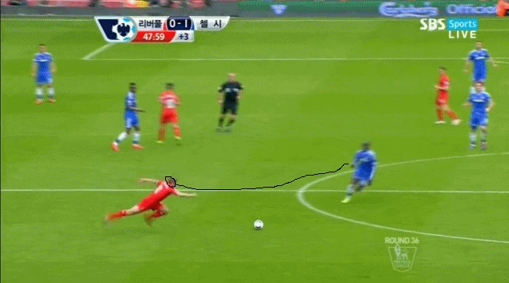

<html>
<head>
 
  <meta charset="utf-8">
</head>
<body>
  <h1><a href="https://en.wikipedia.org/wiki/Steven_Gerrard" target="_blank" title="리버풀은 빅클럽 아니야">제라드 그는 누구인가?</a></h1>
  <ol>
    <li><a href="https://namu.wiki/w/%EC%8A%A4%ED%8B%B0%EB%B8%90%20%EC%A0%9C%EB%9D%BC%EB%93%9C" target="blank" title="제라드 나무위키">나무위키</a></li>
    <li><a href="https://www.instagram.com/stevengerrard" target="_blank" title="제라드의 인스타 그램">제라드 본인 인스타 그램</a></li>
    <li><a href="https://www.google.com/search?q=%EC%A0%9C%EB%9D%BC%EB%93%9C&rlz=1C1QJDC_enKR897KR897&oq=%EC%A0%9C%EB%9D%BC%EB%93%9C&aqs=chrome..69i57j69i59j69i60j69i61.960j0j4&sourceid=chrome&ie=UTF-8" target="_blank" title="구글로 치는 제라드">제라드 구글 버전</a></li>
  </ol>
</body>
  <h2>제라드의 실수를 정리해 보자</h2>
  
제라드가 사코의 패스를 받다가 퍼스트 터치 후 예상치 못하게 근처에 있던 뎀바 바에 당황해 급하게 볼을 점유하려던 도중 미끄러져 넘어지고 말았고, 뎀바 바가 볼을 낚아채면서 그대로 선제골을 득점했다. 다급해진 리버풀은 후반전에 10백 형태로 나오는 첼시에게 맹공을 퍼부었으나 좀처럼 첼시의 방패는 뚫리지 않았고, 끝내 경기 종료 직전 페르난도 토레스의 패스를 받은 윌리안에게 추가골을 허용하면서 무너져 내렸다. 이 패배로 자력 우승의 기회는 맨시티에게로 넘어갔다. 일정상으로 맨시티가 너무나도 유리한지라 만약 이대로 맨시티가 2연승으로 우승을 확정 짓게 된다면 이 실수는 리버풀 팬들에게도 그렇지만, 무엇보다 제라드 본인에게 평생 잊혀지지 않을 뼈아픈 기억이 될 것이다. 그러나 콥들은 억장이 무너지는 가운데서도 그 누구보다도 리버풀의 리그 우승을 갈망했던 게 바로 제라드였고 13-14 시즌 그의 주장이자 핵심 미드필더로서의 공헌이 리버풀이 여기까지 올 수 있었던 이유라는걸 알기에 차마 그 실수로 그를 비난하지 못했다. 이 때 그는 자살까지 생각했을 정도로 정신적인 슬럼프에 빠졌다고 한다.

그리고 37라운드 크리스탈 팰리스전에서 3골 차 리드에도 부족한 골득실을 만회하기 위해 무리하게 공격 일변도로 나가다가 3:3 무승부를 기록하며 사실상 리그 우승은 좌절, 결국 맨시티에게 리그 우승을 내주게 된다.

<h3>영원히 고통받는 제라드ㅋㅋㅋㅋㅋㅋㅋ</h3>

<iframe width="702" height="395" src="https://www.youtube.com/embed/sRQ-LO1fnk8" frameborder="0" allow="accelerometer; autoplay; encrypted-media; gyroscope; picture-in-picture" allowfullscreen></iframe>
영상참고

</body>
</html>
